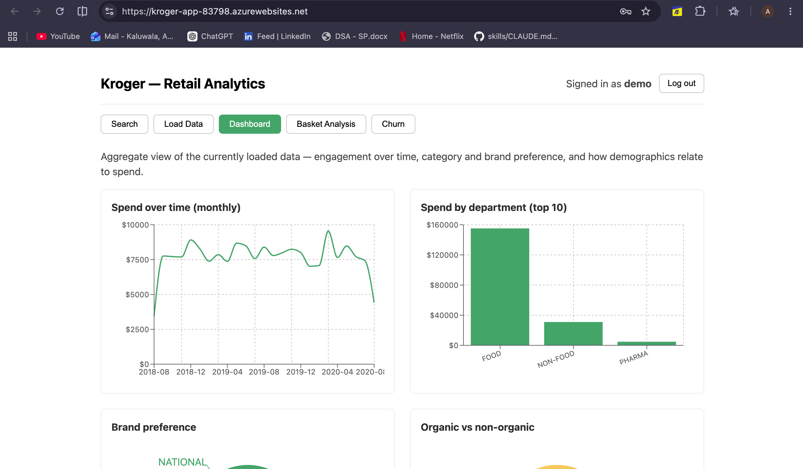
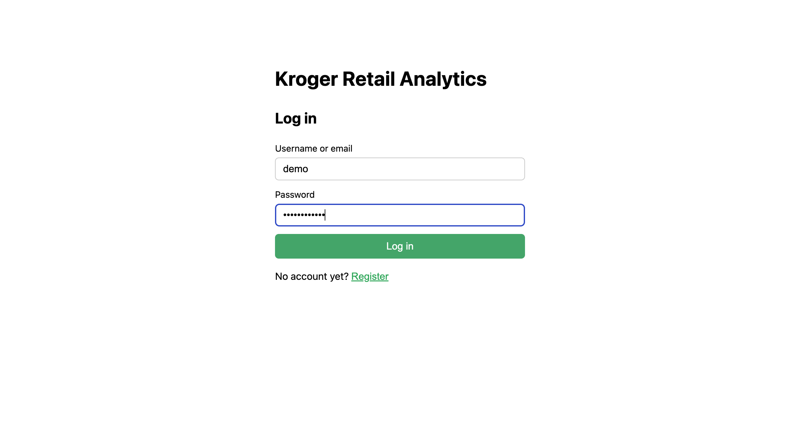
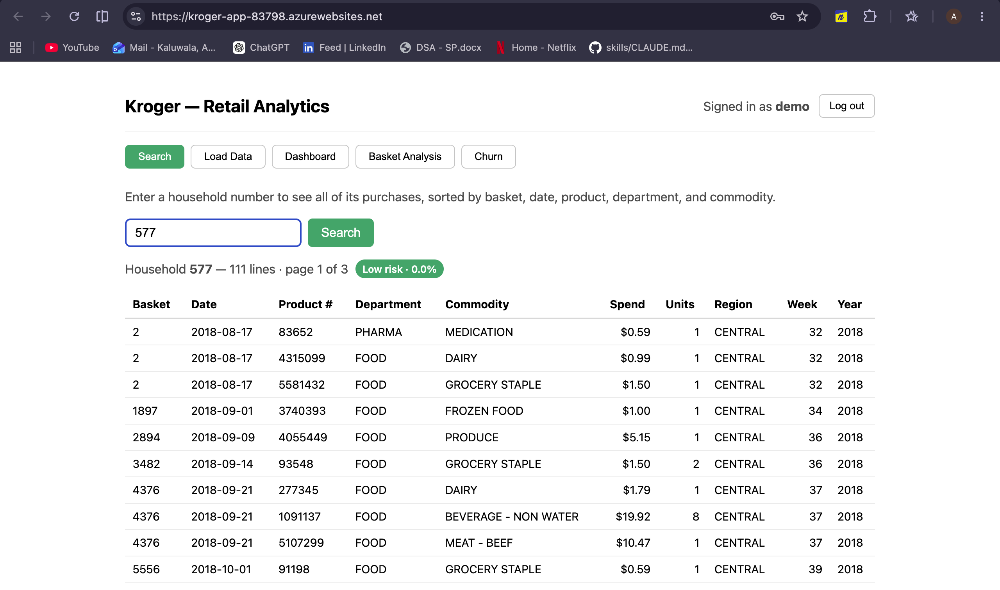
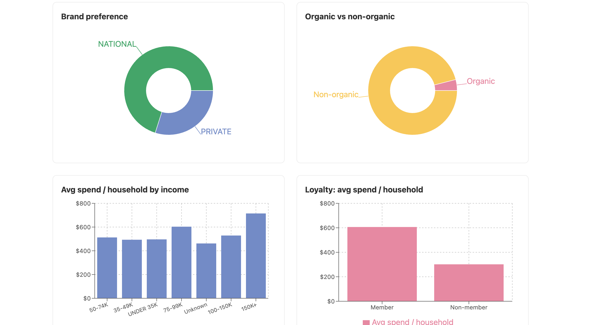
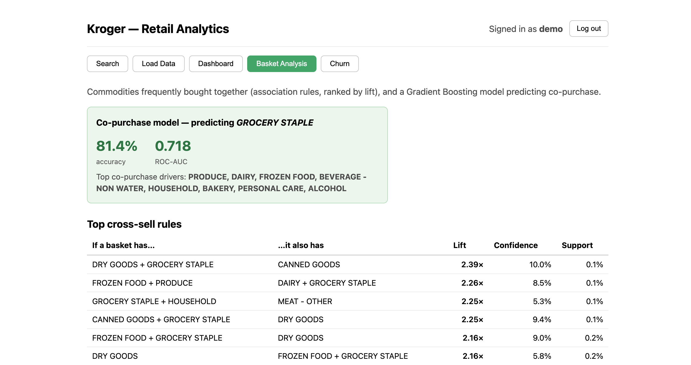
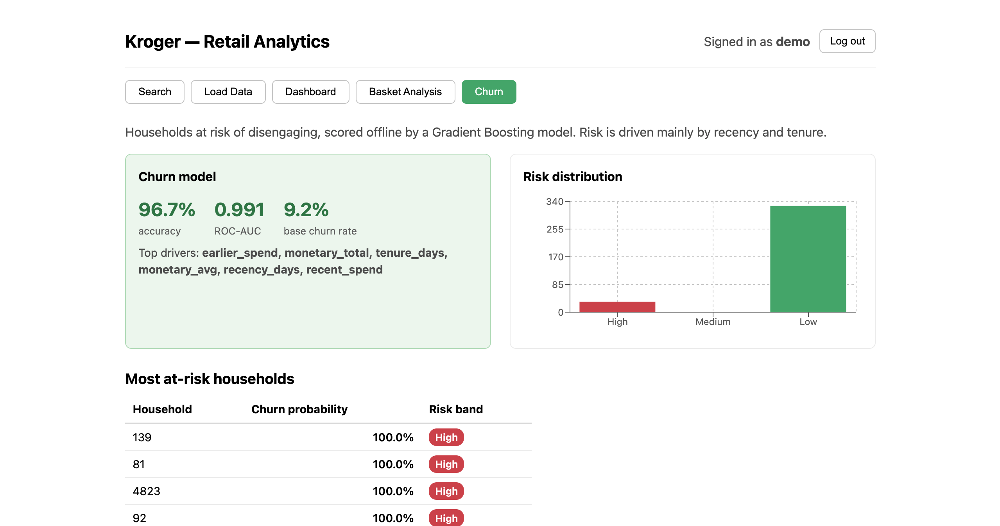
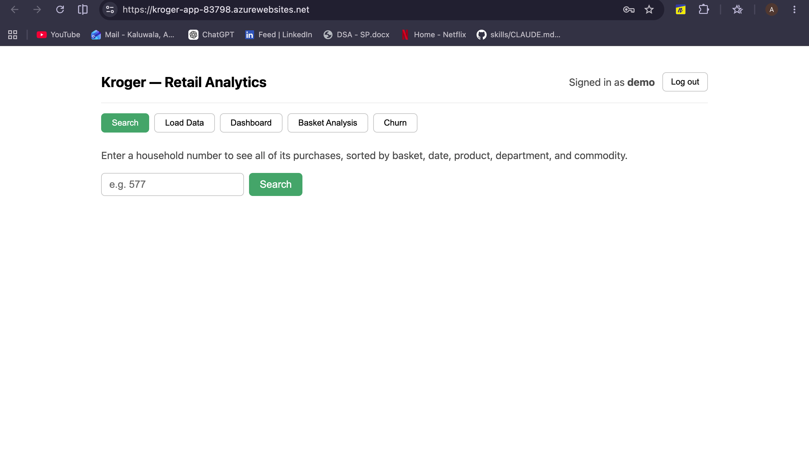
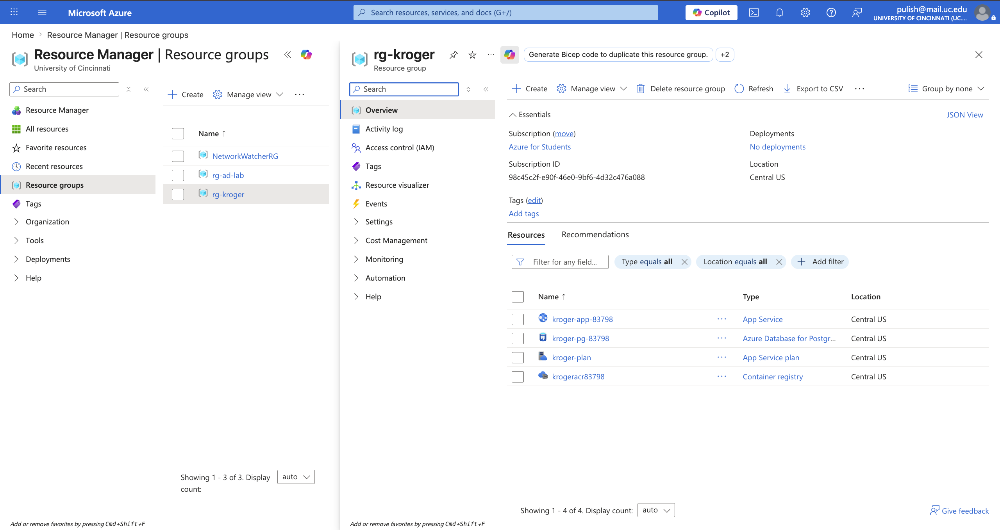

# Kroger Retail Analytics

**🔗 Live demo: [kroger-app.onrender.com](https://kroger-app.onrender.com)** — log in as
`demo` / `password123`. *(Free Render instance; if it's been idle, the first load may take
~50s to wake up.)*

An end-to-end retail analytics application on the 84.51°/Kroger **"Complete Journey"**
dataset (400 households, ~67k products, ~2 years of transactions). A logged-in user can
load the datasets, pull any household's purchase history, explore an analytics dashboard,
and review two machine-learning models — market-basket cross-sell rules and per-household
churn risk.

It is built as a **backend-focused resume project**: a layered TypeScript API, a
PostgreSQL data model, a React UI, and **offline Python ML** whose results are precomputed
into the database and served by the API. The whole stack runs locally with one command,
and ships as a single production image that was deployed to Azure as a one-time proof.



## What this demonstrates

- **Backend engineering** — a strict layered Express + TypeScript API (controller →
  service → repository), JWT auth with hashed passwords, request validation, and
  integration tests at the HTTP seam.
- **Data engineering** — a normalized PostgreSQL model via Prisma, a streaming CSV ETL
  that handles the dataset's real-world quirks, and aggregate SQL for the dashboard.
- **Machine learning** — offline scikit-learn jobs (FP-Growth association rules, two
  Gradient Boosting models) that write results to the database; no live Python at runtime.
- **Cloud & infra** — fully Dockerized local dev, a single multi-stage production image,
  and a scripted one-time Azure deploy (App Service for Containers + Azure Database for
  PostgreSQL).

## Tech stack

| Layer     | Technology                                            |
| --------- | ----------------------------------------------------- |
| API       | Node.js · Express · TypeScript (layered)              |
| Database  | PostgreSQL · Prisma ORM                               |
| Web       | React · Vite · Recharts                               |
| ML        | Python · scikit-learn · mlxtend (offline, results → DB)|
| Dev/Infra | Docker Compose · Azure (one-time deploy)              |

## Quick start

Prerequisite: **[Docker Desktop](https://www.docker.com/products/docker-desktop/)** running.
Node, Postgres, and Python all run inside containers — nothing else to install.

```bash
cp .env.example .env          # 1. create your local env file
docker compose up --build     # 2. boot the whole stack (db + API + web)
```

Then open **http://localhost:5173** and register an account (or log in as `demo` /
`password123` after seeding). Load the sample data on the **Load Data** tab, then explore.

```bash
docker compose exec api npm run load   # optional: seed the bundled sample via CLI
docker compose exec api npm test       # run the API test suite (49 tests)
```

## Features

A single React app with five tabs, all gated behind authentication.

**Authentication** — register / log in with username, email, and password. Passwords are
bcrypt-hashed; a JWT gates the rest of the app.



**Household search** — pull any household's full purchase history, joined across
households, transactions, and products, sorted by the assignment's required keys
(household, basket, date, product, department, commodity), paginated, with the household's
churn-risk badge.



**Load Data** — upload the latest Households, Products, and Transactions CSVs from the
browser; the API runs them through the same streaming loader as the CLI and reports the
row counts. *(Loading replaces the current dataset — see [Limitations](#limitations).)*

**Dashboard** — six aggregate panels: spend over time, spend by department, brand and
organic mix, and average spend per household by income band and loyalty membership.



**Basket analysis** — FP-Growth association rules (commodities bought together, ranked by
lift) plus a Gradient Boosting co-purchase model with its accuracy / ROC-AUC and top
drivers.



**Churn** — per-household churn risk from a Gradient Boosting model, with the at-risk
ranking, a risk-band distribution, and the model's evaluation and top drivers.



## Architecture

```
Browser (React/Vite)
  │  relative /api/* calls (same-origin in prod; proxied in dev)
  ▼
Express + TypeScript API  ── controller → service → repository ──►  PostgreSQL (Prisma)
  │                                                                     ▲
  │  serves the built React app in production                          │  precomputed
  ▼                                                                     │  results
(static React build)                         Offline Python ML  ───────┘
                                             (FP-Growth, Gradient Boosting)
                                             run on demand, never at request time
```

- **Layered API.** Controllers handle HTTP only, services hold business logic,
  repositories own all database access. Each feature is one module.
- **Offline ML → DB.** Python jobs read transactions, train models, and write results
  (`basket_rules`, `household_churn`, …) into Prisma-owned tables. The API only ever
  serves precomputed rows, so the runtime stays a pure TypeScript service.
- **One production image.** A multi-stage build compiles the React app and has Express
  serve it same-origin, so the browser uses the same relative `/api/*` URLs in dev and
  prod. Migrations run on container boot.

See **[CONTEXT.md](CONTEXT.md)** for the domain glossary and **[docs/adr/](docs/adr/)** for
the key engineering decisions and their trade-offs.

## Running the offline ML jobs

The ML container is behind a Compose **profile**, so it never starts with
`docker compose up`. Run it on demand:

```bash
docker compose run --rm ml python basket_analysis.py   # → basket_rules, basket_model_metric
docker compose run --rm ml python churn.py             # → household_churn, churn_model_metric
docker compose run --rm ml pytest -q                   # the ML unit tests
```

Re-running each job replaces its results; the Basket and Churn tabs then reflect the new
output.

## Assignment requirements → implementation

| # | Requirement                                             | Where                                              |
|---|---------------------------------------------------------|----------------------------------------------------|
| 1 | Web server + interactive page (username/password/email) | Auth module + Azure App Service deploy             |
| 2 | Datastore + load data; HSHD #10 display pull            | PostgreSQL/Prisma model + streaming ETL + Search   |
| 3 | Interactive search by `Hshd_num` (required sort)        | **Search** tab → `/api/households/:n/pull`          |
| 4 | Data-loading web app                                    | **Load Data** tab → `/api/ingest`                   |
| 5 | Dashboard exploring retail questions                    | **Dashboard** tab → `/api/dashboard`                |
| 6 | ML basket analysis (Lin. Reg / RF / **GBM**)            | **Basket Analysis** — FP-Growth rules + GBM model  |
| 7 | Churn prediction                                        | **Churn** tab — Gradient Boosting risk model       |
| — | Cloud (Azure)                                           | One-time deploy → screenshots → teardown (below)   |

## Engineering decisions & trade-offs

Recorded as ADRs under **[docs/adr/](docs/adr/)**. Highlights:

- **Express over NestJS**, and **polyglot** (TypeScript API + offline Python ML) over
  Python-only — transparency for learning, and TS as the stronger backend signal.
- **Layered architecture + HTTP-seam integration tests** — tests assert external behavior
  over real HTTP against a dedicated test database.
- **JWT over httpOnly session cookies**, **bcrypt over argon2id** — interview-standard,
  dependency-light choices (with the trade-offs noted in the ADRs).
- **Offline ML precomputed into the DB** — keeps the runtime a pure TS API and makes
  requests fast and Python-free.

## Limitations

Stated honestly — naming trade-offs beats pretending there are none.

- **Data loading is destructive.** An upload (or `npm run load`) truncates and reloads;
  it replaces the dataset rather than appending. Intentional for a single-user analytics
  app, but not multi-tenant-safe.
- **Churn is recency-driven.** The label ("no purchase in the final 90-day window") is
  mechanically related to recency-at-cutoff, so the model's high ROC-AUC reflects an easy,
  recency-dominated signal — a sound, standard framing, but not a claim of deep predictive
  power. See [ADR-0006](docs/adr/0006-churn-cutoff-window-label.md).
- **The API runs via `tsx`** (no ahead-of-time compile to JavaScript). Fine for this
  project; an AOT build would be a natural production hardening step.

## Deployment

The app ships as a single production image (Express serving the React build, migrations on
boot) and has two documented deployments:

- **Live demo — Render + Neon (always-on, free):** the public link at the top runs the
  same image on a free Render web service against a free Neon PostgreSQL database. Guide:
  **[docs/deploy/render.md](docs/deploy/render.md)**.
- **Azure (one-time proof):** described below.

### Azure (one-time proof)

The app was also deployed to Azure as a one-time **deploy → screenshot → tear down** proof,
not an always-on service — the durable deliverable is this repo and these screenshots. A single
production image runs on **Azure App Service for Containers** against **Azure Database for
PostgreSQL**, all in one resource group; `infra/azure/deploy.sh` provisions it and
`infra/azure/teardown.sh` removes everything. Full walkthrough:
**[docs/deploy/azure.md](docs/deploy/azure.md)**.

| Live app on Azure | Azure resources |
|---|---|
|  |  |

Smoke-test the production image locally first:

```bash
docker compose -p kroger-prod -f docker-compose.prod.yml up --build   # http://localhost:8080
```

## Project structure

```
.
├── apps/
│   ├── api/                 # Express + TypeScript API
│   │   ├── src/
│   │   │   ├── core/        # config + shared Prisma client
│   │   │   ├── modules/     # features, each: controller → service → repository
│   │   │   ├── ingestion/   # streaming CSV ETL (pure, unit-tested cleaners)
│   │   │   ├── app.ts       # builds the Express app (imported by tests)
│   │   │   └── server.ts    # starts the HTTP listener
│   │   ├── prisma/          # schema + migrations
│   │   └── tests/           # integration tests (HTTP seam)
│   └── web/                 # React + Vite frontend (5 feature tabs)
├── ml/                      # offline Python ML (FP-Growth, Gradient Boosting)
├── infra/azure/             # deploy + teardown scripts
├── docs/                    # ADRs, deploy guide + screenshots, agent config
├── CONTEXT.md               # domain glossary
├── Dockerfile               # multi-stage production image
├── docker-compose.yml       # one-command local environment
└── docker-compose.prod.yml  # local smoke test of the production image
```

## Development notes

- Source folders are bind-mounted into the containers, so code edits hot-reload. After
  adding a **new** API route/file, restart the API container (`docker compose restart api`)
  — file-watch across the macOS bind mount can miss new files.
- In dev, the Vite server proxies `/api/*` to the API container (same-origin, no CORS);
  in prod, Express serves the React build at the same origin — so the frontend code is
  identical in both.
- The 128 MB full transactions file is git-ignored; a trimmed sample under `data/sample/`
  is committed for local runs.
